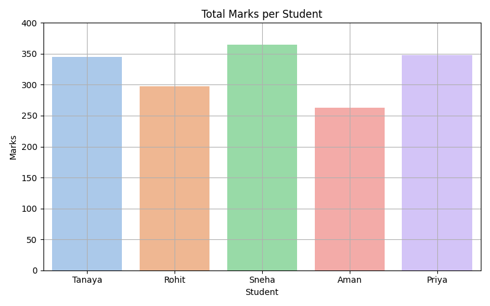
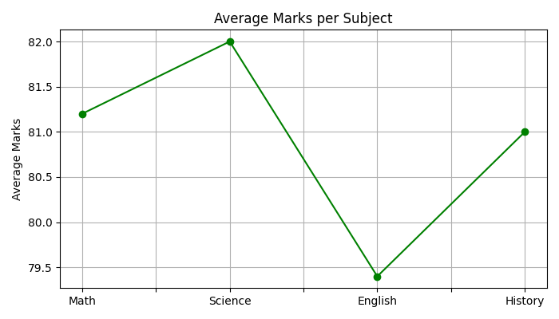
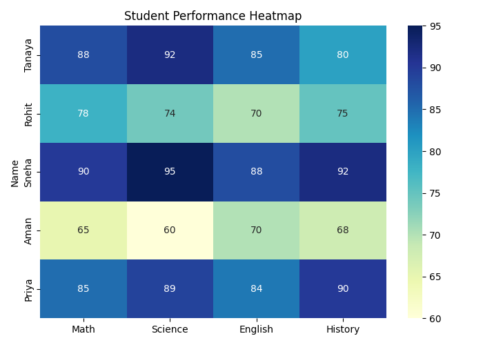

# Student_mark_visualizer
A python project for visualizing students marks using pandas and matplotlib.

A beginner-friendly Python project that visualizes student marks using `pandas`, `matplotlib`, and `seaborn`.

## 📁 Project Files
- `student_marks_visualizer.py` – Main Python script
- `marks.csv` – Sample student marks data
- `README.md` – This file
- `requirements.txt` – Python libraries required

## 📊 Visualizations Included
- Total marks per student (bar chart)
- Average marks per subject (line chart)
- Heatmap of student scores

## ▶️ How to Run

1. Install required libraries:
   ```bash
   pip install -r requirements.txt

## 📊 Output Examples

### 1. Total Marks per Student


### 2. Average Marks per Subject


### 3. Performance Heatmap


